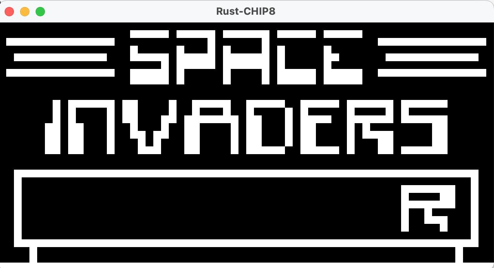
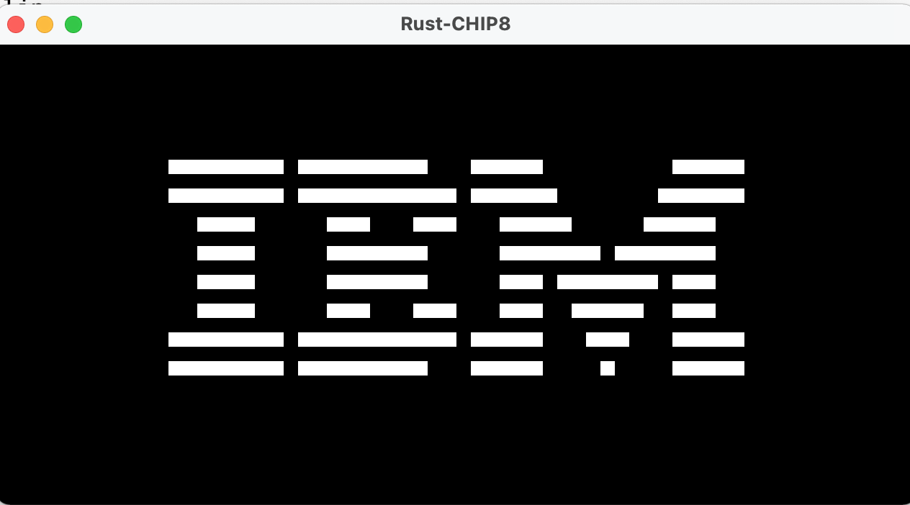
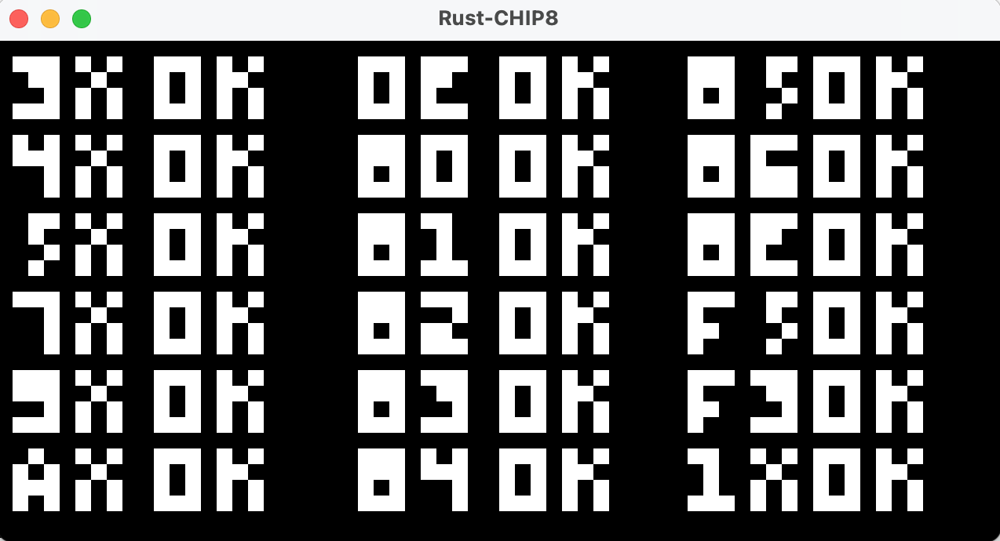
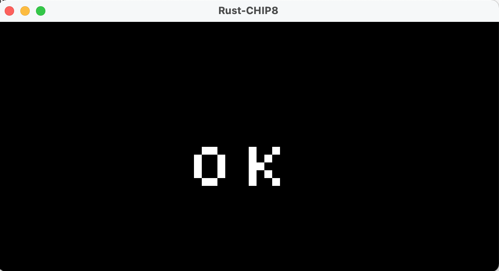
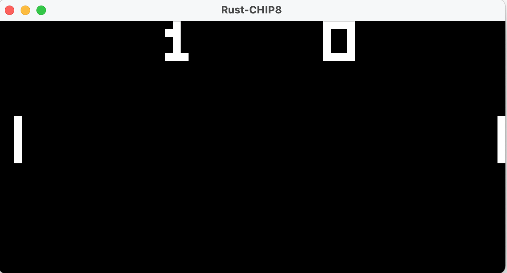

# Rust CHIP8

A really simple CHIP8 emulator/interpreter written in Rust. Built using Tobias V. Langhoffs excellent guide: https://tobiasvl.github.io/blog/write-a-chip-8-emulator/

Uses Pixels and Winit for window and drawing to a texture.

Key handling is slightly inexact, uses key_held rather than keeping a local state of press/release.

#### TODO:
* Sound playback

#### Issues:
* Space invaders glitches after hitting a monster or two. Could be a COSMAC "quirk" that needs adressing.
* The interpreter (still) runs at a bit varying speed, especially when holding down keys.

### Technical description
I recently implemented a CHIP8 interpreter in Go (https://github.com/eriklupander/go-chip8) so I sort-of ported that code over to Rust as a learning excerise. Naturally, that means this is my very first Rust code ever and should be read as such!

I struggled a bit getting used to syntax, initializations, the borrow checker etc, but I think the end-result was rather nice, at least not a complete mess, which may say something about the Rust language. 

While the Go implementation used Ebitengine's graphics and key-handling APIs, the winit / pixels combo used here was perhaps more straightforward once I got my head around its event-loop.

I chose to make the implementation multi-threaded with the interpreter running at approx 1000 ops/s, while the winit event-loop can tug along at whatever rate it likes. The interpreter thread uses a cloned ARC to _write_ screen updates that the event-loop then could _read_ using another ARC clone. 

Using the Atomic reference counter and Mutex constructs turned out to be a really cool way to assert correctness. While I used `sync.Mutex` in the Go implementation, that was because I knew that I should do that - not because the compiler forced me to. (Though Go's race checker loudly complains!).
 
Also, using `match (instruction, X, Y, N)` including wildcards rather than nested `switch` statements was a really nice improvement compared to the Go version.

## Gallery

#### IBM "hello world" Logo

#### opcode_test.ch8

#### skosulor c8_test

#### Pong

